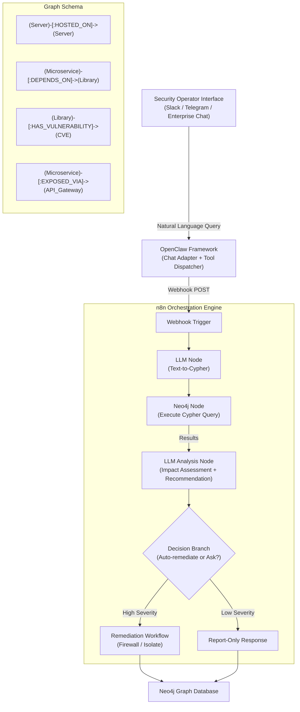

# CyberGraph: A Conversational Threat Response Agent for Web Infrastructure via Knowledge Graphs

> ICWE 2026 Demo Paper Submission

---

## 1. Core Idea & Academic Story

### Problem Statement

Modern Web architectures — built on microservices, containers, and cloud-native stacks — have become extraordinarily complex. A single enterprise web application may have hundreds of interdependent services, libraries, and infrastructure nodes. This creates a critical operational security gap:

1. **Shallow vulnerability detection** — Traditional scanners (e.g., Nessus, Trivy) identify CVEs in individual components but cannot answer: *"Which user-facing web services are now broken or at risk because of this deep dependency vulnerability?"*
2. **Cognitive overload** — Security engineers spend hours manually tracing impact chains through architecture documentation that is often outdated
3. **Slow remediation** — By the time humans understand the blast radius, attackers have already moved laterally

### Proposed Solution

**CyberGraph** is a conversational threat intelligence and response agent that:

- Represents the entire IT infrastructure (servers, microservices, libraries, CVEs) as a **property graph in Neo4j**
- Allows security operators to query impact chains using **natural language** (translated to Cypher via LLM)
- Performs **cascading impact analysis** via graph traversal to identify which top-level web services are affected by a deep dependency vulnerability
- **Autonomously executes remediation actions** (network isolation, firewall rule updates) through n8n workflow triggers — closing the loop from discovery to defense

The system demonstrates a new paradigm for **Agentic Web security**: AI agents that not only reason about infrastructure topology but act on it.

---

## 2. Three Key Contributions

### Contribution 1: Fine-Grained Cascading Impact Analysis

**Innovation:** Answers "what breaks at the top?" when a deep dependency is compromised.

Traditional vulnerability management stops at the component level:
```
Trivy reports: log4j 2.14.1 has CVE-2021-44228 (Log4Shell) in service-X
```

CyberGraph answers the real operational question:
```
Which customer-facing web endpoints are currently reachable through
a dependency chain that includes the vulnerable log4j version?
```

This is implemented as a **bounded graph reachability query** — starting from the vulnerable library node and traversing `DEPENDS_ON` edges upward to find all connected web-facing service nodes, with path distance and criticality scoring.

### Contribution 2: Semantic Security Query Translation (Text-to-Cypher)

**Innovation:** Bridges the gap between security operator intent and graph database queries.

Security engineers speak in natural language:
- *"Show me all services that depend on log4j"*
- *"What is the attack surface if payment-service goes down?"*
- *"Find all externally-exposed services running on Ubuntu 20.04"*

CyberGraph translates these into precise Cypher queries by injecting the current graph schema into the LLM context, enabling zero-training-data adaptation to any organization's specific infrastructure graph.

Example translation:
```
Natural language: "Show me all microservices affected by CVE-2021-44228"
↓
Generated Cypher:
MATCH path = (cve:CVE {id: 'CVE-2021-44228'})<-[:HAS_VULNERABILITY]-(lib:Library)
             <-[:DEPENDS_ON*1..5]-(svc:Microservice)
WHERE svc.exposed = true
RETURN svc.name, svc.tier, length(path) as hops
ORDER BY hops ASC
```

### Contribution 3: Closed-Loop Autonomous Remediation

**Innovation:** Connects graph-based reasoning to executable defense actions.

The pipeline closes the loop:
```
CVE Detected
    ↓
[Graph Query] Identify affected services + blast radius
    ↓
[LLM] Generate remediation recommendation
    ↓
[Operator] Approves via chat: "confirm isolate payment-service"
    ↓
[n8n Workflow] Executes: firewall rule → container network isolation → alert broadcast
    ↓
[Graph Update] Mark affected nodes as "quarantined" in Neo4j
```

This implements the **Agentic Web** vision: AI systems that observe, reason, decide, and act autonomously within defined safety boundaries.

---

## 3. System Architecture



---

## 4. Technology Stack

| Component | Technology | Purpose |
|---|---|---|
| Graph Database | Neo4j Desktop (Community) | IT asset graph storage + traversal |
| Query Language | Cypher | Graph pattern matching |
| Chat Interface | Telegram / Slack | Operator-facing interaction |
| Bot Framework | OpenClaw | Message routing and tool dispatch |
| Workflow Engine | n8n (self-hosted) | Pipeline orchestration + action execution |
| LLM | GPT-4o / Claude Sonnet | Text-to-Cypher + impact analysis |
| Containerization | Docker Compose | Deployment |
| CVE Data | NVD API (NIST) | Real vulnerability metadata |

---

## 5. Demo Development To-Do List

### Phase 1: Neo4j Graph Setup

- [ ] **1.1** Install Neo4j Desktop (free): https://neo4j.com/download/
- [ ] **1.2** Create a new project and database named `cybergraph-demo`
- [ ] **1.3** Run the following Cypher to create the demo infrastructure topology:

```cypher
// Create Servers
CREATE (s1:Server {name: 'web-server-01', ip: '10.0.1.1', os: 'Ubuntu 22.04', tier: 'frontend'})
CREATE (s2:Server {name: 'app-server-01', ip: '10.0.2.1', os: 'CentOS 7', tier: 'backend'})
CREATE (s3:Server {name: 'db-server-01',  ip: '10.0.3.1', os: 'Ubuntu 20.04', tier: 'data'})

// Create Microservices
CREATE (ms1:Microservice {name: 'user-portal', exposed: true,  lang: 'Node.js', version: '3.2.0'})
CREATE (ms2:Microservice {name: 'auth-service', exposed: false, lang: 'Java',   version: '2.1.0'})
CREATE (ms3:Microservice {name: 'payment-service', exposed: false, lang: 'Java', version: '1.8.0', pci_scope: true})
CREATE (ms4:Microservice {name: 'order-service', exposed: false, lang: 'Python', version: '4.0.1'})
CREATE (ms5:Microservice {name: 'notification-service', exposed: false, lang: 'Java', version: '1.2.0'})

// Create Libraries (including vulnerable one)
CREATE (lib1:Library {name: 'log4j-core', version: '2.14.1', language: 'Java'})
CREATE (lib2:Library {name: 'spring-boot', version: '2.5.0', language: 'Java'})
CREATE (lib3:Library {name: 'express', version: '4.18.0', language: 'Node.js'})
CREATE (lib4:Library {name: 'requests', version: '2.26.0', language: 'Python'})

// Create CVE
CREATE (cve1:CVE {id: 'CVE-2021-44228', name: 'Log4Shell', cvss: 10.0,
                  description: 'Remote code execution via JNDI injection in log4j',
                  published: '2021-12-10'})
CREATE (cve2:CVE {id: 'CVE-2022-22965', name: 'Spring4Shell', cvss: 9.8,
                  description: 'RCE in Spring MVC via data binding',
                  published: '2022-03-31'})

// Create Relationships
CREATE (ms1)-[:HOSTED_ON]->(s1)
CREATE (ms2)-[:HOSTED_ON]->(s2)
CREATE (ms3)-[:HOSTED_ON]->(s2)
CREATE (ms4)-[:HOSTED_ON]->(s2)
CREATE (ms5)-[:HOSTED_ON]->(s2)

CREATE (ms1)-[:DEPENDS_ON]->(ms2)
CREATE (ms1)-[:DEPENDS_ON]->(ms4)
CREATE (ms2)-[:DEPENDS_ON]->(lib2)
CREATE (ms3)-[:DEPENDS_ON]->(lib1)
CREATE (ms3)-[:DEPENDS_ON]->(lib2)
CREATE (ms4)-[:DEPENDS_ON]->(lib4)
CREATE (ms5)-[:DEPENDS_ON]->(lib1)
CREATE (ms2)-[:DEPENDS_ON]->(ms3)

CREATE (ms1)-[:DEPENDS_ON]->(lib3)

CREATE (lib1)-[:HAS_VULNERABILITY]->(cve1)
CREATE (lib2)-[:HAS_VULNERABILITY]->(cve2)
```

- [ ] **1.4** Verify the graph in Neo4j Browser with: `MATCH (n) RETURN n`
- [ ] **1.5** Write and test the core impact query manually:

```cypher
// Find all services affected by Log4Shell
MATCH path = (cve:CVE {id: 'CVE-2021-44228'})<-[:HAS_VULNERABILITY]-(lib:Library)
             <-[:DEPENDS_ON*1..5]-(svc:Microservice)
RETURN svc.name, length(path) as dependency_depth, [node in nodes(path) | node.name] as chain
ORDER BY dependency_depth
```

- [ ] **1.6** Export the graph visualization as PNG for the paper

### Phase 2: n8n Text-to-Cypher Workflow

- [ ] **2.1** Start n8n: `docker run -it --rm --name n8n -p 5678:5678 -e N8N_BASIC_AUTH_ACTIVE=false n8nio/n8n`
- [ ] **2.2** Install n8n Neo4j community node (or use HTTP Request to Neo4j REST API)
- [ ] **2.3** Create workflow `CyberGraph-Query-Pipeline`:
  - Add **Webhook** trigger node (POST `/cybergraph`)
- [ ] **2.4** Add **LLM** node for Text-to-Cypher translation:
  - System prompt:
    ```
    You are a Neo4j Cypher query generator for IT infrastructure security analysis.

    Graph Schema:
    - Nodes: Server {name, ip, os, tier}, Microservice {name, exposed, lang, version},
             Library {name, version, language}, CVE {id, name, cvss, description}
    - Relationships: (Microservice)-[:HOSTED_ON]->(Server),
                     (Microservice)-[:DEPENDS_ON]->(Microservice|Library),
                     (Library)-[:HAS_VULNERABILITY]->(CVE)

    Rules:
    1. Return ONLY the Cypher query, no explanation
    2. Always use MATCH...RETURN patterns
    3. For impact analysis, traverse DEPENDS_ON up to 5 hops
    4. Never use DELETE or destructive operations

    User query: {user_message}
    ```
- [ ] **2.5** Add **HTTP Request** node to query Neo4j REST API:
  - URL: `http://localhost:7474/db/neo4j/tx/commit`
  - Method: POST
  - Auth: Basic (neo4j / your-password)
  - Body: `{"statements": [{"statement": "{{ $json.cypher_query }}"}]}`
- [ ] **2.6** Add **LLM Analysis** node to interpret raw query results:
  - Prompt: Convert Neo4j JSON results into human-readable security assessment with risk level (CRITICAL/HIGH/MEDIUM/LOW)
- [ ] **2.7** Test with queries:
  - "What services are affected by Log4Shell?"
  - "Which servers host payment-related services?"
  - "Show me the full dependency chain for user-portal"

### Phase 3: Remediation Action Branch

- [ ] **3.1** Add **IF** node after analysis: branch on `risk_level == CRITICAL`
- [ ] **3.2** For CRITICAL branch, add response asking operator to confirm:
  ```
  🚨 CRITICAL RISK DETECTED
  Affected services: payment-service, auth-service
  Recommended action: Network isolation of app-server-01

  Reply "confirm isolate <service-name>" to execute
  ```
- [ ] **3.3** Create a second n8n Workflow `CyberGraph-Remediation` triggered by operator confirmation message:
  - Parse `confirm isolate <service-name>` from chat
  - **Simulate firewall action**: POST to a mock webhook (or send email) representing the firewall API call
  - Update Neo4j: `MATCH (s:Microservice {name: $name}) SET s.status = 'quarantined'`
  - Return confirmation message with timestamp
- [ ] **3.4** Test the full loop: query → CRITICAL alert → operator confirms → remediation executes → graph updated

### Phase 4: OpenClaw Integration

- [ ] **4.1** Configure OpenClaw to connect to Telegram/Slack
- [ ] **4.2** Register two tools in OpenClaw:
  - `query_infrastructure`: routes to n8n CyberGraph-Query-Pipeline webhook
  - `execute_remediation`: routes to n8n CyberGraph-Remediation webhook
- [ ] **4.3** Test end-to-end: send natural language query in chat → get Neo4j-backed response

### Phase 5: Demo Video Recording

- [ ] **5.1** Set up dual-screen recording:
  - **Left panel**: Neo4j Browser showing the live graph (nodes highlighted as query runs)
  - **Right panel**: Chat interface with operator conversation
- [ ] **5.2** Record the following scenario sequence:
  1. **Discovery**: "I just saw news about Log4Shell, are we affected?" → Agent queries graph → Returns impact chain
  2. **Deep dive**: "Show me the payment service dependency chain" → Visualize path
  3. **Risk assessment**: "What's the blast radius if auth-service is compromised?" → Connected subgraph
  4. **Remediation**: Agent flags CRITICAL → Operator confirms → Isolation executes → Graph node changes color to red
- [ ] **5.3** Optionally: show the Neo4j node status updating in real-time during remediation
- [ ] **5.4** Edit to 3 minutes, add captions for key steps

---

## 6. Demo Scenarios & Expected Outputs

### Scenario A: CVE Impact Discovery
```
Operator: "Check if we're affected by Log4Shell"

CyberGraph:
🔍 Querying infrastructure graph...

⚠️ CRITICAL: 2 services directly affected by CVE-2021-44228 (Log4Shell, CVSS 10.0)

Affected services:
├── payment-service (app-server-01) — direct dependency on log4j-core 2.14.1
│   └── reachable from: user-portal [user-portal → auth-service → payment-service]
└── notification-service (app-server-01) — direct dependency on log4j-core 2.14.1

🚨 CRITICAL: payment-service is PCI-scoped. Immediate action required.
Recommend: Isolate app-server-01 or update log4j to 2.17.1+

Type "confirm isolate payment-service" to execute network isolation.
```

### Scenario B: Dependency Audit
```
Operator: "What Java services are running on app-server-01?"

CyberGraph:
Services on app-server-01 (10.0.2.1, CentOS 7):
• auth-service     v2.1.0  [spring-boot 2.5.0 ⚠️ CVE-2022-22965]
• payment-service  v1.8.0  [log4j 2.14.1 🚨 CVE-2021-44228, spring-boot 2.5.0 ⚠️]
• notification-service v1.2.0  [log4j 2.14.1 🚨 CVE-2021-44228]

3 services with known critical vulnerabilities.
```

### Scenario C: Remediation Execution
```
Operator: "confirm isolate payment-service"

CyberGraph:
✅ Remediation executed at 14:32:07 UTC
• Firewall rule added: DENY inbound/outbound 10.0.2.1:8080
• payment-service marked as [QUARANTINED] in infrastructure graph
• Alert sent to security-team@company.com
• Incident ticket #INC-2847 created

⚠️ NOTE: 3 upstream services will lose payment functionality.
Affected: user-portal checkout flow, order-service billing
```

---

## 7. Paper Outline (LNCS 4-page Demo Paper)

```
Title: CyberGraph: Conversational Threat Response for Web Infrastructure
       via Knowledge Graph Traversal and Autonomous Remediation

Abstract (150 words):
  - Problem: CVE blast radius in microservice web architectures
  - Solution: graph-based cascading impact analysis + natural language interface
  - Key result: identifies N-hop dependency chains in <X ms, real-time operator loop

1. Introduction (0.5 col)
   - Hook: Log4Shell affected millions of services via hidden dependency
   - Gap: scanners find CVEs but not web-level blast radius
   - Contribution list

2. Related Work (0.5 col)
   - Knowledge graph-based security
   - Text-to-Cypher / NL-to-query systems
   - Autonomous security response (SOAR)

3. CyberGraph Architecture (1.5 col)
   3.1 Infrastructure Graph Model (Table: node/edge types)
   3.2 Text-to-Cypher Translation Pipeline
   3.3 Cascading Impact Analysis Algorithm
       (Figure 1: graph traversal visualization from Neo4j)
   3.4 Closed-Loop Remediation Workflow
       (Figure 2: n8n workflow screenshot)

4. Demonstration Scenario (1 col)
   4.1 Demo Infrastructure Setup
   4.2 Log4Shell Impact Discovery Walk-through
       (Figure 3: dual-screen demo screenshot)
   4.3 Operator-Confirmed Remediation

5. Discussion & Future Work (0.3 col)
   - Limitations: graph maintenance overhead, LLM Cypher accuracy
   - Future: streaming CVE ingestion, graph diffing for change detection

6. Conclusion (0.2 col)

References (~8-10 refs)
```

---

## 8. Project Structure

```
CyberGraph/
├── README.md                      ← This file
├── paper/                         ← LNCS LaTeX paper
│   ├── main.tex
│   ├── llncs.cls
│   ├── splncs04.bst
│   └── references.bib
├── neo4j/
│   ├── init-graph.cypher          ← Full topology setup script
│   └── queries/
│       ├── impact-analysis.cypher
│       ├── dependency-audit.cypher
│       └── blast-radius.cypher
├── n8n/
│   ├── cybergraph-query.json      ← Exportable n8n query workflow
│   └── cybergraph-remediate.json  ← Exportable n8n remediation workflow
├── openclaw/
│   └── tools-config.yaml          ← Tool definitions for OpenClaw
├── scripts/
│   └── demo-setup.sh              ← One-script environment bootstrap
├── assets/
│   ├── graph-topology.png         ← Neo4j visualization export
│   └── demo-screenshots/
└── docker-compose.yml             ← Starts Neo4j + n8n together
```

---

## 9. Key References

- Robinson, I., et al. (2015). *Graph Databases: New Opportunities for Connected Data*. O'Reilly.
- Chen, M., et al. (2023). Text-to-SQL in the Wild: A Naturally-Collected Benchmark. *ACL*.
- Milajerdi, S. M., et al. (2019). HOLMES: Real-time APT Detection through Correlation of Suspicious Information Flows. *IEEE S&P*.
- Peng, C., et al. (2022). Threat Intelligence Knowledge Graphs: A Survey. *ACM CSUR*.
- Sikos, L. F. (2018). Cybersecurity Knowledge Graphs. *Knowledge and Information Systems*.
- CVE-2021-44228 (Log4Shell). National Vulnerability Database, NIST.
